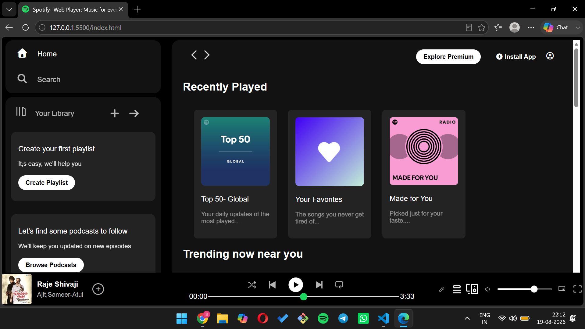

# Spotify Web Player

A responsive Spotify-inspired web player interface focused on recreating the structure, visual hierarchy, and interaction patterns of a modern music streaming platform.

The project was built from scratch with a focus on translating a complex desktop music interface into a structured, responsive frontend using HTML, CSS, and Tailwind CSS.

## Live Demo

[View Live Demo](https://shoanWagh-26.github.io/spotify-web-player/)

## What I Built

I recreated the core visual experience of a modern music streaming dashboard rather than building a simple static landing page.

The interface is organized around the way a real music product is consumed:

- Persistent sidebar navigation for Home, Search, and Library
- Playlist and podcast discovery sections
- Recently played and trending content
- Featured music categories
- A persistent bottom music player
- Playback controls, progress bar, volume control, and player actions
- Responsive layout behavior across different screen sizes

The main objective was to practice building a UI with multiple content sections while maintaining consistent spacing, hierarchy, and visual relationships throughout the page.

## Key Frontend Decisions

### 1. Structured and reusable styling

Repeated content such as music cards, navigation items, and player controls follows consistent HTML structures and shared CSS classes instead of styling every element independently.

### 2. Visual hierarchy over excessive decoration

The interface uses spacing, typography, contrast, card grouping, and positioning to guide the user through the page rather than relying on unnecessary visual effects.

### 3. Persistent music-player experience

The bottom player is visually separated from the main browsing area, creating the familiar structure of a music streaming application.

### 4. Responsive layout thinking

The layout was structured to adapt its content and spacing instead of treating the desktop version as the only target.

## Features

- Spotify-inspired dark interface
- Responsive navigation layout
- Recently played music section
- Trending music section
- Featured music categories
- Library and playlist areas
- Persistent music player
- Playback and volume controls
- Progress bar
- Responsive card-based content layout
- Custom visual assets and interface icons

## Tech Stack

- **HTML5** — semantic page structure and content organization
- **CSS3** — custom layouts, responsive styling, positioning, and visual design
- **Tailwind CSS** — utility-based styling
- **Font Awesome** — interface icons
- **Google Fonts** — typography

## Project Focus

This project was primarily built to strengthen my frontend fundamentals around:

- Translating a reference interface into code
- Structuring complex layouts
- Responsive CSS
- Reusable styling patterns
- Asset organization
- UI consistency
- Building a polished frontend without relying on a component framework

## Project Preview

> Main interface showcasing the navigation system, content sections, music cards, and persistent player layout.
